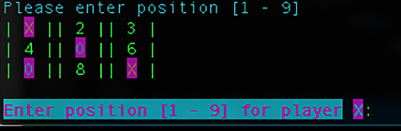

# Welcome to Vick's 2 Player Tic Tac Toe!



Just a simple console based, 2 player ***Tac Tac Toe*** game in Python. Attempted to make without looking at others.

## Install
*Create a virtual environment*
```shell
python3 -m venv tic_tac_toe
```

*Enable environment*
```shell
source bin/activate
```

*Run script*
```shell
python TicTacToe.py
```

## Play
- Open a terminal
- Select '`x`' or '`o`' to start (case insensitive)
- Enter the position (`1`, `2`, `3`...) for your turn

# Enjoy!
